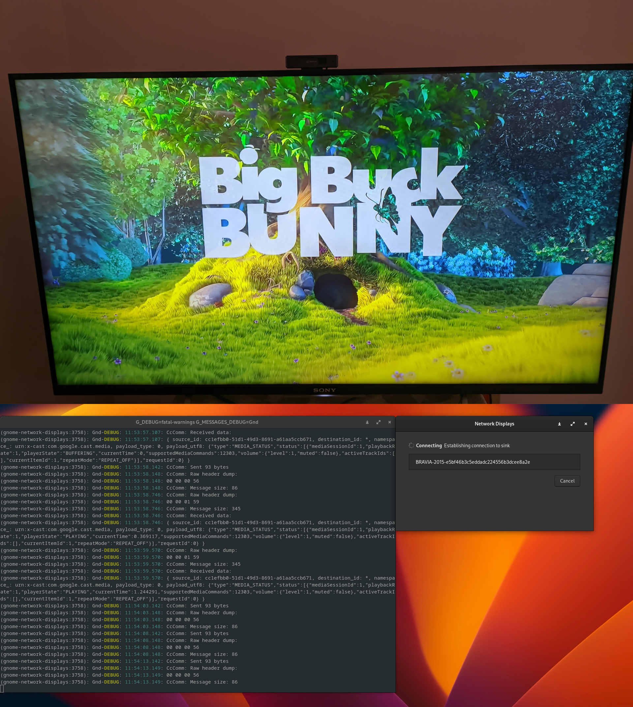
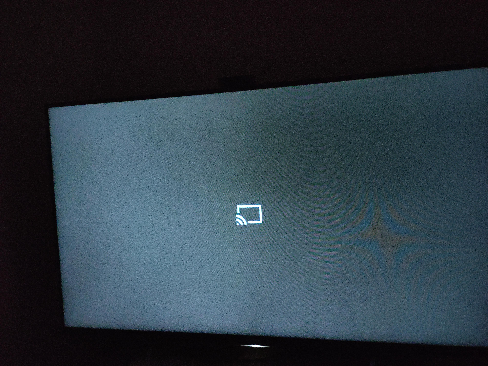

+++
author = "Anupam Kumar"
title = "Chromecast Protocol"
date = "2022-08-03"
description = "A brief look at the Chromecast protocol"
tags = [
	"gsoc",
	"gnome",
	"chromecast"
]
categories = [ "gsoc" ]
aliases = []
image = "Big-Buck-Bunny.jpg"
+++

&nbsp;

### After almost a month of reconnaissance through the study of Chromium's code, VLC's code and other people's attempts, we finally have figured out the Chromecast protocol, and it works flawlessly and reliably!



### Ignoring the previous blog posts, here's a quick rundown of the Chromecast protocol:

- There are two parties involved: the Sender and the Receiver
- Typical sender apps are the Chrome browser, and the Android and iOS platforms
- Chromecast devices consist of two different receivers (so to say):
	- The in-built receiver app that accepts connection requests and handles all other communications with the Sender
	- The Web Receiver app is optionally loaded and opened upon request by the Sender, again through messages handled by the former receiver
- The first job is to make a Sender app
- Now, we discover the available Chromecast devices in the local network through mDNS with the identifier `_googlecast._tcp`
- Next step is to open a TCP and then a TLS connection over that to the Chromecast device on port `8009`
- After a successful TLS connection:
	- The first thing we do is check the authenticity of the Chromecast (we fake it in our app)
	- Next, a "virtual connection" is opened to the Chromecast
	- At this point, we are eligible to query the status of the Chromecast device (which includes information such as the opened app, volume, and supported namespaces, among other details)
	- We can send messages to open an app, Android apps such as the YouTube app or other "media player apps" either custom made or readily available from Google
	- Whenever any app is opened or closed, that is, if the state of the Chromecast changes, a broadcast message is sent out to all the connected senders regarding the present status (you may have already seen it on your Android device when a media controller notification pops up if something is being played on Chromecast)
	- The apps accept requests to play, pause, change to the next item in the queue, and other similar commands
	- In addition to those, we can send requests to play supported contents on the apps (or custom data for custom web receivers -- the second type of receivers. These should be hosted on HTTPS domains and registered on [Google Cast SDK Developer Console](https://cast.google.com/publish))
- Lastly, we close the app, the virtual connection (or as I have recently taken to calling it, VC), and the TCP/TLS connection.
- Important point to note here is that an app can keep running even if the VC and the TCP/TLS connections are closed. We need to be explicit about closing the app with a message.



Haah, that was a lot to take in! Fear not, there's more.

---

### Specifics

This is best explained using logs.
Here are cleaned bits of logs from the GNOME Network Displays app interacting with Chromecast:
(**Only the part inside "payload_utf8" is structured in JSON, all parameters outside that like "source_id" are fields in the protobuf schema and only spread out nicely here for presentation purposes -- JSON key-pair highlighting**)

```json
Sent message:
{
  "source_id": "sender-gnd",
  "destination_id": "receiver-0",
  "namespace_": "urn:x-cast:com.google.cast.tp.deviceauth",
  "payload_type": 1,
  "payload_utf8": (null)
}
```

Now, if you look closely, the first message sent has a sender_id as `sender-gnd` and receiver id as `receiver-0`. The sender_id can be anything prefixed with `sender-` but I doubt it allows more than six characters after the hyphen. It doesn't really matter.
The receiver has a default id `receiver-0` as found out through Chromium code, and again doesn't matter since that is all the purpose it serves.

The first message we ever send is the "authentication challenge" (look for the further reading links below) that should ideally contain some binary information and `has_binary_payload` as 1.
We are not strict with the authenticity of the Chromecast device we are connecting to, so we send an empty request but on the correct namespace. The logs don't print out the `payload_binary` field since it is only used once (here) and is empty with length 0 anyways.

---

```json
Sent message:
{
  "source_id": "sender-gnd",
  "destination_id": "receiver-0",
  "namespace_": "urn:x-cast:com.google.cast.tp.connection",
  "payload_type": 0,
  "payload_utf8": {
    "type": "CONNECT",
    "userAgent": "GND/0.90.5  (X11; Linux x86_64)",
    "connType": 0,
    "origin": {},
    "senderInfo": {
      "sdkType": 2,
      "version": "X11; Linux x86_64",
      "browserVersion": "X11; Linux x86_64",
      "platform": 6,
      "connectionType": 1
    }
  }
}
```

The second message is the virtual connection message, where we include some random metadata and most importantly the `type` and `connType` keys. We indicate the connection type as `0` or `strong`. This comes from Chromium's nomenclature for connection types: strong, weak and invisible, out of which weak is not used (don't ask me why). The connection type must be strong if destination_id `receiver-0` is used, as a comment says there. And it seems the default connection type is strong, but we choose not to take any chances.

---

```json
Sent message:
{
  "source_id": "sender-gnd",
  "destination_id": "receiver-0",
  "namespace_": "urn:x-cast:com.google.cast.receiver",
  "payload_type": 0,
  "payload_utf8": {
    "type": "GET_STATUS",
    "requestId": 2
  }
}
```

Onto the next request. We manually request a status report with type `GET_STATUS` on namespace `urn:x-cast:com.google.cast.receiver`. With sharp eyes and a keen mind, you would have spotted a key called `requestId` in the payload. This is a unique identifier for every message we send, excluding those on special namespaces, such as the virtual connection or the ping message.
The easiest way to keep it unique is to initialize it to 1 and increment it for every outgoing message. Guess how Chromium and VLC do this.
The `requestId` field is also present in the received messages and is `0` for all the broadcast messages.

---

```json
Received message:
{
  "source_id": "receiver-0",
  "destination_id": "sender-gnd",
  "namespace_": "urn:x-cast:com.google.cast.receiver",
  "payload_type": 0,
  "payload_utf8": {
    "requestId": 2,
    "status": {
      "applications": [
        {
          "appId": "2C6A6E3D",
          "appType": "ANDROID_TV",
          "displayName": "YouTube",
          "iconUrl": "",
          "isIdleScreen": false,
          "launchedFromCloud": false,
          "namespaces": [
            { "name": "urn:x-cast:com.google.cast.media" },
            { "name": "urn:x-cast:com.google.cast.system" },
            { "name": "urn:x-cast:com.google.cast.cac" },
            { "name": "urn:x-cast:com.google.youtube.mdx" }
          ],
          "sessionId": "0167f70a-6430-45ab-9714-fd2f09d70b2b",
          "statusText": "Youtube",
          "transportId": "0167f70a-6430-45ab-9714-fd2f09d70b2b",
          "universalAppId": "233637DE"
        }
      ],
      "isActiveInput": true,
      "isStandBy": false,
      "userEq": {},
      "volume": {
        "controlType": "master",
        "level": 0.10000000149011612,
        "muted": false,
        "stepInterval": 0.009999999776482582
      }
    },
    "type": "RECEIVER_STATUS"
  }
}
```

Hey, we received a message. It has the type `RECEIVER_STATUS` and is not a broadcast one. We specifically requested this of the Chromecast.

Let's break it down byte by byte.
The usual fields `source_id`, `destination_id` etc. are nothing special, but the payload sure packs some exciting data. We have received the state of the Chromecast where it reports the volume details, stand-by state, userEq (?), and if the Chromecast is the active input ([more info](https://developers.google.com/cast/docs/reference/web_sender/chrome.cast.Receiver#isActiveInput)), and the running applications.
Only one app is currently running - YouTube (without YouTube Premium). A bunch of namespaces are supported for this particular app, and we should not dive into that for this post.

---

```json
Sent message:
{
  "source_id": "sender-gnd",
  "destination_id": "receiver-0",
  "namespace_": "urn:x-cast:com.google.cast.receiver",
  "payload_type": 0,
  "payload_utf8": {
    "type": "LAUNCH",
    "appId": "CC1AD845",
    "requestId": 3
  }
}
```

Too bad we don't need to watch YouTube videos now. We need to watch our Big Buck Bunny hosted on Google's servers (not from Google's CDNs, but Google's hosted storage, makes sense?).
We launch the Default Media Receiver app (this is the same VLC and [the CacTool use](https://developers.google.com/cast/docs/debugging/cac_tool)) by sending a `LAUNCH` message with its `appId`.

---

```json
Received message:
{
  "source_id": "receiver-0",
  "destination_id": "*",
  "namespace_": "urn:x-cast:com.google.cast.receiver",
  "payload_type": 0,
  "payload_utf8": {
    "requestId": 0,
    "status": {
      "isActiveInput": true,
      "isStandBy": false,
      "userEq": {},
      "volume": {
        "controlType": "master",
        "level": 0.10000000149011612,
        "muted": false,
        "stepInterval": 0.009999999776482582
      }
    },
    "type": "RECEIVER_STATUS"
  }
}
```

Cool, we received a broadcast message that YouTube has been closed.
(**I have configured my Android TV to limit background processes to at most two at a time (makes the system very snappy). This might have caused the YouTube app to close even when it wasn't needed/intended in this case.**)

---

```json
Received message:
{
  "source_id": "receiver-0",
  "destination_id": "*",
  "namespace_": "urn:x-cast:com.google.cast.receiver",
  "payload_type": 0,
  "payload_utf8": {
    "requestId": 3,
    "status": {
      "applications": [
        {
          "appId": "CC1AD845",
          "appType": "WEB",
          "displayName": "Default Media Receiver",
          "iconUrl": "",
          "isIdleScreen": false,
          "launchedFromCloud": false,
          "namespaces": [
            { "name": "urn:x-cast:com.google.cast.cac" },
            { "name": "urn:x-cast:com.google.cast.debugoverlay" },
            { "name": "urn:x-cast:com.google.cast.broadcast" },
            { "name": "urn:x-cast:com.google.cast.media" }
          ],
          "sessionId": "014f4bf2-2c29-481f-ab50-ef7d6ff210ac",
          "statusText": "Default Media Receiver",
          "transportId": "014f4bf2-2c29-481f-ab50-ef7d6ff210ac",
          "universalAppId": "CC1AD845"
        }
      ],
      "isActiveInput": true,
      "isStandBy": false,
      "userEq": {},
      "volume": {
        "controlType": "master",
        "level": 0.10000000149011612,
        "muted": false,
        "stepInterval": 0.009999999776482582
      }
    },
    "type": "RECEIVER_STATUS"
  }
}
```

Ah, our media app has taken the stage now. This is a `WEB` application and runs on Chromium (maybe bare-bones, but it is Chromium).
It accepts messages with the shown namespaces where you'd recognize namespace ending in `cac`. The one with `debugoverlay` probably relates to [this](https://developers.google.com/cast/docs/debugging/cast_debug_logger#debug_overlay).
I suspect the `broadcast` one is responsible for passing on the events to be broadcasted to the internal receiver.
Finally, we are here for the `media` namespace. We need to send the URL of the media to play on this namespace. But wait, if multiple apps were open, how would the Chromecast or we even figure out for which app a particular message was meant? `transportId` serves as the receiver_id for those messages.

---

```json
Sent message:
{
  "source_id": "sender-gnd",
  "destination_id": "014f4bf2-2c29-481f-ab50-ef7d6ff210ac",
  "namespace_": "urn:x-cast:com.google.cast.tp.connection",
  "payload_type": 0,
  "payload_utf8": {
    "type": "CONNECT",
    "userAgent": "GND/0.90.5  (X11; Linux x86_64)",
    "connType": 0,
    "origin": {},
    "senderInfo": {
      "sdkType": 2,
      "version": "X11; Linux x86_64",
      "browserVersion": "X11; Linux x86_64",
      "platform": 6,
      "connectionType": 1
    }
  }
}
```

We need a second connection to the `CC1AD845` app to talk to it (it is what it is).

---

```json
Received message:
{
  "source_id": "014f4bf2-2c29-481f-ab50-ef7d6ff210ac",
  "destination_id": "*",
  "namespace_": "urn:x-cast:com.google.cast.media",
  "payload_type": 0,
  "payload_utf8": {
    "type": "MEDIA_STATUS",
    "status": [],
    "requestId": 0
  }
}
```

Now we start receiving broadcast messages from the Default Media Receiver. For now, it's doing nothing. See the dark image above.
Note that the type of message is `MEDIA_STATUS` and is on the `urn:x-cast:com.google.cast.media` namespace.

---

```json
Sent message:
{
  "source_id": "sender-gnd",
  "destination_id": "014f4bf2-2c29-481f-ab50-ef7d6ff210ac",
  "namespace_": "urn:x-cast:com.google.cast.media",
  "payload_type": 0,
  "payload_utf8": {
    "type": "LOAD",
    "media": {
      "contentId": "https://commondatastorage.googleapis.com/gtv-videos-bucket/CastVideos/mp4/BigBuckBunny.mp4",
      "streamType": "BUFFERED",
      "contentType": "video/mp4"
    },
    "requestId": 4
  }
}
```

Let's send our Google-hosted media file's URL to the media app. Specifying the mime type of the file and the stream type is mandatory. Another option for the stream type could be `LIVE`, where seek functionality can be enabled or disabled as per wish, and there would be a visual clue on the screen to show that (may not be present on custom-made web receivers).
`contentId` and `contentUrl` have some differences but would not matter in our case, [Docs for media key](https://developers.google.com/cast/docs/reference/web_sender/chrome.cast.media.MediaInfo).

---

```json
Received message:
{
  "source_id": "014f4bf2-2c29-481f-ab50-ef7d6ff210ac",
  "destination_id": "*",
  "namespace_": "urn:x-cast:com.google.cast.media",
  "payload_type": 0,
  "payload_utf8": {
    "type": "MEDIA_STATUS",
    "status": [
      {
        "mediaSessionId": 1,
        "playbackRate": 1,
        "playerState": "IDLE",
        "currentTime": 0,
        "supportedMediaCommands": 12303,
        "volume": { "level": 1, "muted": false },
        "media": {
          "contentId": "https://commondatastorage.googleapis.com/gtv-videos-bucket/CastVideos/mp4/BigBuckBunny.mp4",
          "streamType": "BUFFERED",
          "contentType": "video/mp4",
          "mediaCategory": "VIDEO"
        },
        "currentItemId": 1,
        "extendedStatus": {
          "playerState": "LOADING",
          "media": {
            "contentId": "https://commondatastorage.googleapis.com/gtv-videos-bucket/CastVideos/mp4/BigBuckBunny.mp4",
            "streamType": "BUFFERED",
            "contentType": "video/mp4",
            "mediaCategory": "VIDEO"
          },
          "mediaSessionId": 1
        },
        "repeatMode": "REPEAT_OFF"
      }
    ],
    "requestId": 0
  }
}
```

Yay!! Now would you look at that -- it is loading our Google-hosted media file encoded in mp4.

Most of the keys should be self-explanatory :)
For `supportedMediaCommands`, I just hope that it is not a count.

If you want, you can put a bunch of videos in a queue and let them play or control them using `NEXT` or `PREVIOUS` messages or using your hand-held remote or using your IR-equipped Android device or using your Android TV remote (don't have a clue if this works with other Chromecast devices).
Queuing the videos is left as an assignment for the reader and should be trivial to implement.

---

```json
Received message:
{
  "source_id": "014f4bf2-2c29-481f-ab50-ef7d6ff210ac",
  "destination_id": "*",
  "namespace_": "urn:x-cast:com.google.cast.media",
  "payload_type": 0,
  "payload_utf8": {
    "type": "MEDIA_STATUS",
    "status": [
      {
        "mediaSessionId": 1,
        "playbackRate": 1,
        "playerState": "BUFFERING",
        "currentTime": 0,
        "supportedMediaCommands": 12303,
        "volume": { "level": 1, "muted": false },
        "currentItemId": 1,
        "repeatMode": "REPEAT_OFF"
      }
    ],
    "requestId": 0
  }
}
```

No idea why it would not send the complete status message here but whatever, it is buffering the video.

---

```json
Received message:
{
  "source_id": "014f4bf2-2c29-481f-ab50-ef7d6ff210ac",
  "destination_id": "*",
  "namespace_": "urn:x-cast:com.google.cast.media",
  "payload_type": 0,
  "payload_utf8": {
    "type": "MEDIA_STATUS",
    "status": [
      {
        "mediaSessionId": 1,
        "playbackRate": 1,
        "playerState": "PLAYING",
        "currentTime": 0,
        "supportedMediaCommands": 12303,
        "volume": { "level": 1, "muted": false },
        "activeTrackIds": [],
        "media": {
          "contentId": "https://commondatastorage.googleapis.com/gtv-videos-bucket/CastVideos/mp4/BigBuckBunny.mp4",
          "streamType": "BUFFERED",
          "contentType": "video/mp4",
          "mediaCategory": "VIDEO",
          "duration": 596.474195,
          "tracks": [],
          "breakClips": [],
          "breaks": []
        },
        "currentItemId": 1,
        "items": [
          {
            "itemId": 1,
            "media": {
              "contentId": "https://commondatastorage.googleapis.com/gtv-videos-bucket/CastVideos/mp4/BigBuckBunny.mp4",
              "streamType": "BUFFERED",
              "contentType": "video/mp4",
              "mediaCategory": "VIDEO",
              "duration": 596.474195
            },
            "orderId": 0
          }
        ],
        "repeatMode": "REPEAT_OFF"
      }
    ],
    "requestId": 4
  }
}
```

Spot the difference challenge. Look at the message two messages above, the one that reports that our Google-hosted media file is being loaded, and then this one we got here.

With sharp eyes and a keen mind, you would have spotted that there are some additional keys here:
- `activeTrackIds`: No idea what this does. See if you can make sense of [this](https://developers.google.com/cast/docs/reference/web_sender/chrome.cast.media.LoadRequest#activeTrackIds).
- `duration`: It inferred this itself. We may provide this in the `LOAD` request itself though.
- `tracks`: List of track objects (track as in an audio track) -- [docs](https://developers.google.com/cast/docs/reference/web_sender/chrome.cast.media.Track)
- `orderId`: This is related to queue, [see](https://developers.google.com/cast/docs/reference/web_receiver/cast.framework.messages.QueueItem?hl=en#orderId)

`breakClips` and `breaks` refer to ad breaks in between the video, not even going to pick that up.

One category of messages you can't see being sent and received are `PING` and `PONG`. We send `PING` messages every 5 seconds to keep the connection alive. A sub-bullet point in our TODO list is to drop the connection if a `PONG` is not received for 6 seconds in response.

---

### GUADEC 2022

I presented my then latest findings and disclosed all of my plans for this month before all of the users and developers of GNOME located all over the world.
Would you believe this? Someone recorded that and called it Intern Lightning Talk?!
Since it is already sitting in the open internet, it wouldn't hurt to show it to my dear readers as well (even if it's not reader"s").
> [Timestamp to the Revelation](https://youtu.be/KK9K2CG8U40?t=18010)
> [Timestamp to all the Intern Presentations](https://www.youtube.com/watch?v=KK9K2CG8U40&t=16874s)

### Follow up on the previous blog post

- The bug that stood between a successful communication between the Chromecast and us turns out to have nothing to do with Chromecast itself but was a problem with C pointers. I would like to leave it at that, don't wanna look stupid on the internet, right?
- Maybe we don't get to discuss Custom Web Receivers after all. In the _very verbose_ logs of Chromium recorded for inspection of its communication with the Chromecast, where all we did was connect to Chromecast and cast a tab, we found out that it uses a receiver app named `Chrome Mirroring` with id `0F5096E8` and namespace `urn:x-cast:com.google.cast.webrtc`. This was a rather interesting find. We hopefully wouldn't need to bother making, registering and hosting a Custom Web Receiver app.

### Plan going forward

- Clearing out some minor bugs
- Handling of Chromecast states
- Figuring out the WebRTC messages

Track the project's progress [here](https://gitlab.gnome.org/GNOME/gnome-network-displays/-/merge_requests/171)

### My dear mentors

My mentors, Benjamin Berg and Claudio Wunder were ever present for me, day in and day out.
Stuck somewhere, need advice on some stuff about C, GObject, Chromecast, anything at all, they'd just jump in to my rescue.
This project couldn't possibly be done without their consistent support.

---

\* All the images used above were stripped off of all metadata using the [Metadata Cleaner app](https://flathub.org/apps/details/fr.romainvigier.MetadataCleaner)
\* Further reading on authentication of Chromecast devices: [Blog post by Romain Picard](https://blog.oakbits.com/google-cast-protocol-receiver-authentication.html)
\* [A Custom Web Receiver in Action](https://openbase.com/js/node-red-contrib-cast/documentation)
\* [Chromium's VirtualConnectionType enum](https://source.chromium.org/chromium/chromium/src/+/main:components/cast_channel/cast_message_util.h;drc=5ef9498cd3f6e965991dacce1333ac6a7050c26a;l=206)
\* [Chromecast Web Receiver Docs](https://developers.google.com/cast/docs/reference/web_receiver)
\* [Chromecast Web Sender Docs](https://developers.google.com/cast/docs/reference/web_sender)

