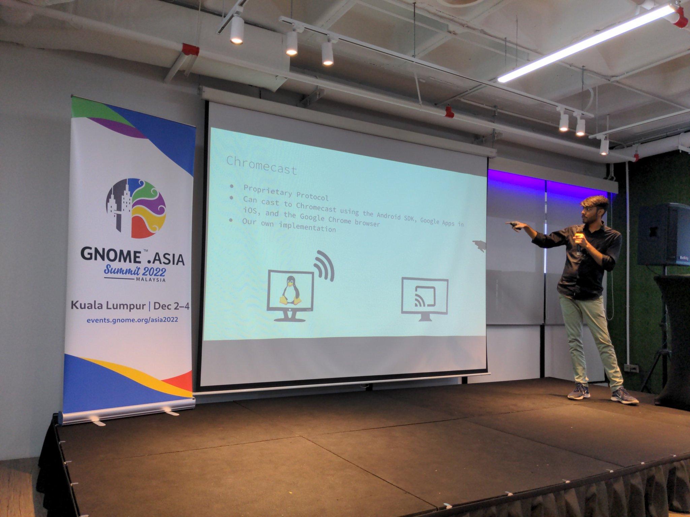

+++
author = "Anupam Kumar"
title = "GNOME Asia Feels"
date = "2022-12-13"
description = "Getting to know other GNOMIEs and visit to Kuala Lumpur"
tags = ["gnome", "trip", "conference"]
categories = []
aliases = []
image = "2022GNOMEAsia-cover.jpg"
+++

First and foremost I want to thank GNOME for sponsoring my visit to Kuala Lumpur, Malaysia.
It was nice meeting the people who have similar interests and also who actually build the GNOME I use and love.

All of them absolutely love open source and the work they do. And most of all, they were all excited and happy to showcase their art. Those would be one of the most engaging communications I've had in quite a while.

There were people from Singapore, Malaysia, India, Denmark, Hong Kong, Albania, Italy, and USA. I attended all that talks I could and apologize for the ones I missed owing to sleeping late in the morning due to my body clock. Malaysian time is 2h30m ahead of Indian time.
Still I enjoyed them a lot and hope that you all enjoyed my presentation as well.

> Speaking of which, some people asked me "what was the presentation actually about?" Yeah.
> To squash further FAQs and doubts, here is a simple explanation: I made an addition/extension to an already capable and working app. All it does it cast your screen to a bigger screen if it supports Wi-Fi and isn't Apple owned. My addition revolved around Google's Chromecast, while the existing one was Miracast.
> Simply put, remove the HDMI cable and just use Wi-Fi in your next presentation.

Here is a pic of me at the conference. Thanks to Jona Azizaj (@jonatoni) for the amazing shot!

And not forgetting the main purpose of the whole trip.

Lastly I would have to loved to see my mentors Benjamin and Claudio at the summit. I'll probably BBB them sometime later :)
