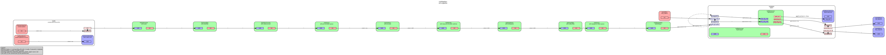
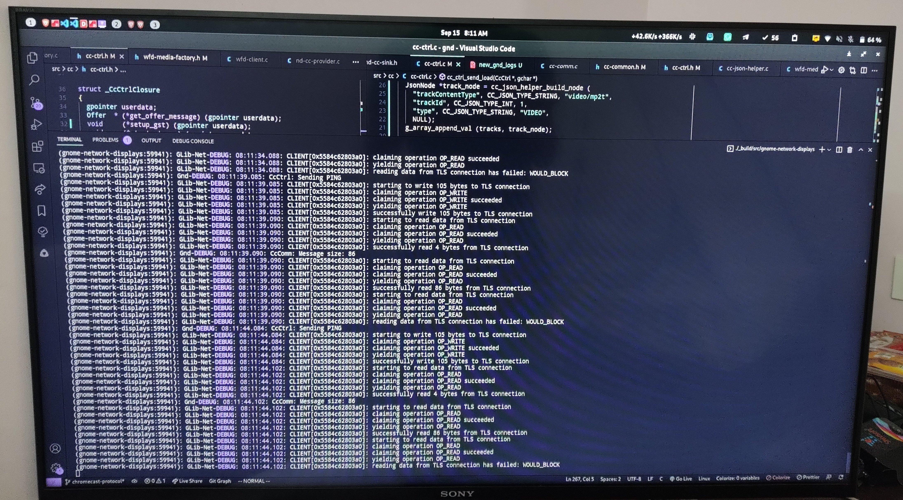

+++
author = "Anupam Kumar"
title = "GSoC Finale"
date = "2022-09-17"
description = "Final report on GSoC progress"
tags = [
  "gsoc",
  "gnome",
]
categories = [
  "gsoc",
]
aliases = []
image = "blank.svg"
+++

It definitely was a long journey. Although I didn't write enough blogs to outline the exact shaping of it, here's a final report on what has been going on.

The workings of the protocol and the connection specifics have already been discussed before, so let's keep this short.

- Discovery using mDNS
- Connection over TCP
- Messages are structured in JSON and encoded using protobuf
- All the messages have at least a `sender id`, `destination id`, `namespace`, `payload type`, and the `payload` itself

Last time we connected to the Chromecast device, we opened a media receiver web app and played a video on it.
Our goal, as it remains, is to cast our desktop/window on the Chromecast display. We can choose from three different streaming protocols to have what we want: DASH, HLS, and Smooth Streaming.

Implementing one of those was the primary goal until a sparse study of Chromium's code unveiled a namespace called `urn:x-cast:com.google.cast.webrtc`.
We also used Google Chrome's (or Chromium's) tab casting feature and recorded the logs. Looking at the logs virtually revealed the entire message exchange and the steps involved, but it was no documentation by any stretch. We had no idea what the possibilities were or the error cases, for that matter.
While trying to figure out the Chromecast protocol, we noticed many logs in the message exchange files that were not in Chrome's logs, even with the highest level of verbosity. `DLOG` and `VLOG`, for example, did not print out the `DLOG`, where I suspect D stands for development and V for verbose.
It would have been easier to see what exactly happens with Chrome's logs. We tried using the dev symbols that come with the Linux distribution, but Arch Linux had some issues at the time.
Nevertheless, I don't suppose that would've worked for the logs.

So the only option left was to read the code and figure it out ourselves. And that's what we did since no one was successful with the webrtc stream before on the internet.
We came across [this directory](https://source.chromium.org/chromium/chromium/src/+/main:third_party/openscreen/src/cast/). It contained all the knowledge there was. The proto files, the json schemas, the header files with all the constants, all the good stuff we needed. From the names of the files itself we knew how to send the stream to Chromecast, except that we didn't (_hint_ _hint_ something to do with encryption).

Let me loop back to the negotiation part of the WebRTC stream. In normal WebRTC, there is a separate entity that relays messages between the two parties interested. Here that happens to be the sender itself.
We open the app called `Chrome Mirroring` (app id `0F5096E8`). This is for audio and video streaming. There is also one for only audio streaming. You can find a few others [here](https://source.chromium.org/chromium/chromium/src/+/main:third_party/openscreen/src/cast/common/public/cast_streaming_app_ids.h).
Now, when the app is opened, we get a receiver status message, and we start communicating with the app from this point on by addressing the messages to the session id of the app, after connecting to it first.

The first thing we do is send an offer message with the necessary information for the streams we wish to send and the encryption keys, among other details. Here is an example message:

```json
{
  "source_id": "sender-990878",
  "destination_id": "a8a79f97-a63e-4555-baec-53e3f49e6df3",
  "namespace": "urn:x-cast:com.google.cast.webrtc",
  "payload_utf8": {
    "offer": {
      "castMode": "mirroring",
      "receiverGetStatus": true,
      "supportedStreams": [
        {
          "aesIvMask": "1D20EA1C710E5598ECF80FB26ABC57B0",
          "aesKey": "BB0CAE24F76EA1CAC9A383CFB1CFD54E",
          "bitRate": 102000,
          "channels": 2,
          "codecName": "opus",
          "index": 0,
          "receiverRtcpEventLog": true,
          "rtpExtensions": "adaptive_playout_delay",
          "rtpPayloadType": 127,
          "rtpProfile": "cast",
          "sampleRate": 48000,
          "ssrc": 144842,
          "targetDelay": 400,
          "timeBase": "1/48000",
          "type": "audio_source"
        },
        {
          "aesIvMask": "1D20EA1C710E5598ECF80FB26ABC57B0",
          "aesKey": "BB0CAE24F76EA1CAC9A383CFB1CFD54E",
          "codecName": "vp8",
          "index": 1,
          "maxBitRate": 5000000,
          "maxFrameRate": "30000/1000",
          "receiverRtcpEventLog": true,
          "renderMode": "video",
          "resolutions": [{ "height": 1080, "width": 1920 }],
          "rtpExtensions": "adaptive_playout_delay",
          "rtpPayloadType": 96,
          "rtpProfile": "cast",
          "ssrc": 545579,
          "targetDelay": 400,
          "timeBase": "1/90000",
          "type": "video_source"
        }
      ]
    },
    "seqNum": 730137397,
    "type": "OFFER"
  }
}
```

> Note: only the `payload_utf8` is structured in JSON, other sibling keys are part of protobuf.

You see that? All the details are right there in the offer message.
Other codecs are also supported, such as h264, vp9, hevc, and aac.
Although most of the things should be self-explanatory, focus on the key `ssrc` in both the audio and video streams. This is the identifier for the stream.
The AES keys and masks are passed down in the offer message still. The algorithm used however is [AES-CTR-128](https://source.chromium.org/chromium/chromium/src/+/main:third_party/openscreen/src/cast/streaming/frame_crypto.cc;l=102).

We sent an offer. We must receive an answer to it.

```json
{
  "source_id": "a8a79f97-a63e-4555-baec-53e3f49e6df3",
  "destination_id": "sender-990878",
  "namespace": "urn:x-cast:com.google.cast.webrtc",
  "payload_utf8": {
    "answer": {
      "castMode": "mirroring",
      "receiverGetStatus": true,
      "receiverRtcpEventLog": [0, 1],
      "rtpExtensions": [[], []],
      "sendIndexes": [0, 1],
      "ssrcs": [144843, 545580],
      "udpPort": 51810
    },
    "result": "ok",
    "seqNum": 730137397,
    "type": "ANSWER"
  }
}
```

You'd find it weird that the ssrc values have been incremented compared to what we sent. Apart from that, the keys that deserve our attention are `updPort`, `result`, and `type`. If the result is "ok", we collect the port number and start streaming RTP packets and exchanging RTCP packets. For streaming RTP packets, we **need** a controller of the packets, either RTCP or RTSP. Found this out the hard way while messing around with the GStreamer launch command.

After these findings, we had some time left to reorganise the code and handle the edge cases well.
Daily routine was to read docs, write code, test, check logs, and repeat.

Now we had what you can call state management (just a variable and if checks) and some nice JSON string generators.
We jumped into media handling right on. Already having a pipeline to process video and audio in GNOME Network Displays made things easy, but tinkering with it was no easy job until [the saviour](https://gstreamer.freedesktop.org/documentation/tutorials/basic/index.html?gi-language=c) lent a helping hand. The first few tutorials were all that was needed to get to speed.

The pipeline created for video (only) streaming looked like what follows:



You might want to zoom in a little.

This was an unencrypted RTP stream with unencrypted RTCP messages. The only thing to add was an encryption layer over the RTP packets. The plugin `srtpenc` provided by GStreamer did precisely this, except that it did not do AES-CTR, only AES-ICM and AES-GCM. Going deeper, it used the library `libsrtp` by Cisco, which, unfortunately, only has implementations for the same two algorithms.

There are two ways to go moving forward:
- Add necessary headers in `srtpenc` and the AES-CTR implementation in `libsrtp` upstream
- Implement a GStreamer plugin that does what both `srtpenc` and `libsrtp` do with some help from `openssl`

Despite that, we were enticed to test the unencrypted stream as is. We had the following broadcast message (and a blank Chromecast display to go with it).

```json
{
  "source_id": "b7319b19-5641-472e-91d8-daeff9746a68",
  "destination_id": "*",
  "namespace": "urn:x-cast:com.google.cast.media",
  "payload_utf8": {
    "requestId": 0,
    "status": [
      {
        "currentTime": 0.0,
        "disableStreamGrouping": true,
        "media": {
          "contentId": "",
          "contentType": "video/webm",
          "metadata": { "metadataType": 0, "title": "Chrome tab casting" },
          "streamType": "LIVE"
        },
        "mediaSessionId": 0,
        "playbackRate": 1.0,
        "playerState": "PLAYING",
        "supportedMediaCommands": 0,
        "volume": { "level": 0.059999998658895493, "muted": false }
      }
    ],
    "type": "MEDIA_STATUS"
  }
}
```

What does all of this mean for the end-user? Do you wait patiently for us to code the plugin?
Of course not.
Remember that Chromecast also provides three streaming options with the media app, specifically the `Deafult Media Receiver` app (app id `CC1AD845`). We went with HLS.



There is still some time till this lands on [the gitlab](https://gitlab.gnome.org/GNOME/gnome-network-displays/-/merge_requests/171). Some cleanup is left.
And the files (playlist file and the segment files) are served from an nginx server (with CORS header). So that needs to be inside the app as well. Soup is the answer to this one.

Now you won't be able to competitive game on this or use it as a second display, but this surely can handle presentations well.

Huge thanks to my mentors Benjamin Berg (@bberg) and Claudio Wunder (@cwunder).
This project was practically impossible to complete without their help.

PS: In the offer message, we set `castMode` to `mirroring`. There is a second option called `remoting`. From what we gathered, it is a dynamic mode that does not need the codec declarations beforehand and supports RPC messages for some reason. Our best bet is that this has to do with Chrome Remote Desktop and is of no interest to us.

---

This isn't the finale. This is the beginning.
