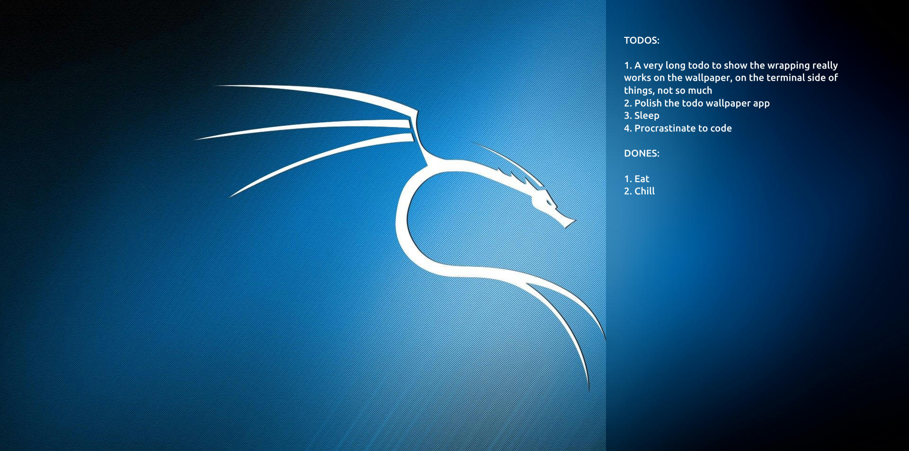

+++
author = "Anupam Kumar"
title = "Todo Wallpaper App in Rust"
date = "2023-04-25"
description = "Terminal todo app that shows all your todos on the wallpaper"
tags = ["todo", "rust"]
categories = [ "recreational" ]
image = "desktop_thumbnail.png"
+++

There is no concept of having desktop widgets/icons in GNOME. The extensions that implement this are for particular use cases like desktop icons for directories and files, showing the clock, etc. and not universal container format that can accomodate different types of widgets.
It is, in theory, possible to create universal containers for all kinds of widgets on the desktop but not now. I am as lazy as always.

I forked the todo app by Tsoding for my own niche use case, took a page from their book (just kidding).
This app was a TUI that, as the name says, helped store todos. The TUI is fancy and pretty usable but did not present (or pretty print) all the todos on the terminal on startup. Again this is also a very easy task but why see it only upon opening the terminal and not always when you log in and are about to start your day?
The fork writes all your todos and dones on your wallpaper for you to see and get back to whatever you were working with.

For now, only GNOME >= 40 is supported, more to follow soon.

Find it here: https://github.com/kyteinsky/todo-wall

Disclaimer: This is alpha software made for learning, fun and personal usage. Use it on your own risk.
